<p align="center">
  
</p>

<h1 align="center">Relay</h1>

<p align="center">
  A full-stack video learning platform. Instructors upload videos, get them transcoded into adaptive HLS streams by an async worker, and earn from enrollments. Learners browse, purchase, watch, and take server-graded quizzes. Admins run payments, payouts, users, courses, and platform settings. Three separate UIs share one Express API.
</p>

<p align="center">
  
  
  
  
  
  
</p>

---

## Overview

Most course platforms store a single video file and stream it as-is. On a fast connection that works. On a laptop connected to hotel Wi-Fi it means constant buffering, because playback cannot adapt to the connection. Relay solves this the way real streaming services do. Instructors upload one file; a background worker transcodes it into three bitrates; the player switches between them live based on network conditions.

The rest of the platform exists because an instructor-facing product needs more than a player. Enrollments and payments with country-specific tax, coupons, server-side quiz grading, progress tracking, instructor analytics, payout management, and an admin panel with separate views for users, payments, and courses. Auth is JWT-based with role middleware that treats instructor and admin surfaces as separate boundaries.

This is a full-stack project. The frontend is a Next.js app. The API is Express. PostgreSQL holds the data, Redis holds the video queue, and RustFS (an S3-compatible server) holds the media. Everything is TypeScript.

## Tech stack

| Layer | Technology |
|-------|-----------|
| Frontend | Next.js, React, TypeScript, Tailwind CSS, shadcn/ui |
| Backend | Express.js, TypeScript, Zod validation |
| Database | PostgreSQL (Neon), Prisma ORM |
| Storage | RustFS (S3-compatible) with presigned URLs |
| Video processing | FFmpeg, BullMQ job queues, Redis |
| Streaming | HLS.js with adaptive bitrate playback |
| Auth | JWT in an httpOnly cookie (7-day expiry), bcrypt |
| Payments | In-app checkout with mock gateway, idempotency keys, coupons, IP-based tax |

## What this project does

### Video delivery (the core)
- Presigned S3 uploads so media never passes through the API server, with progress tracking from the frontend
- Async transcoding into 1080p / 720p / 480p HLS with 6-second segments and a master playlist
- Player with quality selection, playback speed (0.25x to 2x), PiP, fullscreen, keyboard shortcuts
- Status surface from upload to processing to ready or failed, polled by the frontend
- Publish rules tied to processing: a course cannot go live while any video is still encoding or has failed

### Commerce
- Mock checkout with coupons (discount breakdown shown before payment) and tax computed server-side from IP-based country detection using per-country rates stored in the database
- Idempotent payment handling: replaying or double-clicking a checkout cannot create a second charge or enrollment
- Refund flow in the admin panel

### Learning
- Free enrollment or purchase-enrollment, with progress percent computed from lesson completion
- Quizzes graded on the server against a pass threshold, with retries and best-score tracking
- Course progress tracking and per-lesson completion

### Content and roles
- Course builder with chapters and lessons, three content types (video, text, quiz), and a draft/publish workflow that snapshots published content so instructors can edit a live course safely
- Three roles enforced by middleware: learner, instructor, admin
- A separate admin panel (distinct layout, distinct routes) for user management, course moderation, payment refunds, payout approvals, and platform settings

### Analytics
- Instructor dashboards: revenue, enrollments, completion rates, enrollment funnels, lesson completion, country distribution, coupon usage, gross/net earnings, payout tracking
- Admin platform KPIs: revenue trends, geographic distribution, top instructors and courses

## The video pipeline

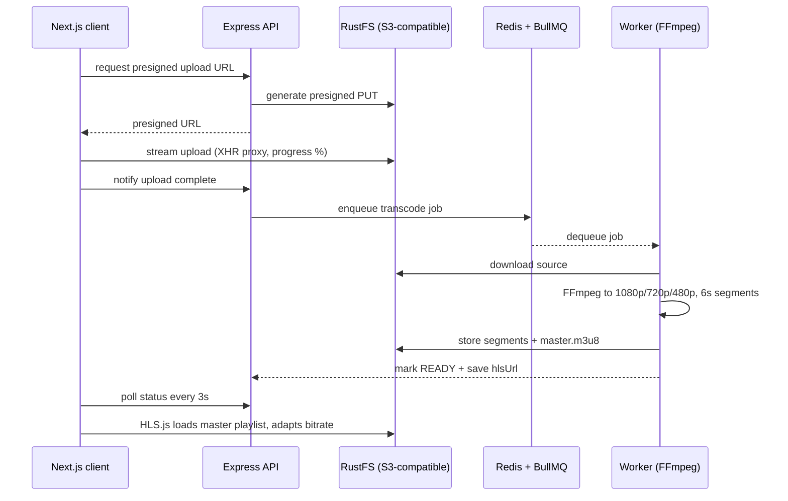

## How I built it (decisions, and what they cost)

| What I did | Why | What it cost me |
|---|---|---|
| Transcoding in a BullMQ queue, not in the request handler | FFmpeg on a 10-minute video can run for minutes. Inline would block API processes, hang behind reverse-proxy timeouts, and vanish on deploy. A Redis-backed queue survives restarts and gives retries and concurrency limits. | Extra infrastructure (Redis) and eventual consistency, which is why the frontend polls status. |
| Multi-bitrate HLS instead of a single MP4 | One manifest lets the player switch 1080p to 480p mid-playback, so a weak connection degrades quality instead of buffering. | Segment and manifest bookkeeping, plus the player must speak HLS (HLS.js does). |
| Presigned S3 URLs for upload and playback | Media bytes never cross the API tier. The server hands out URLs; RustFS takes the traffic. | The server cannot see an upload succeed on its own, so "uploaded" and "processed" are separate states and completion is a notified event. |
| Idempotency keys on checkout | "Check then create" has a race window. Two identical checkouts from a double-click could both pass the check and create two payments. Relay checks for an existing result, creates payment and enrollment inside one `$transaction`, and on a unique-constraint race catches it and returns the existing result. | Clients must send a key, and reusing a stale key is a deliberate false positive. |
| Tax computed server-side from IP country, rates in the DB | A subtotal/tax/total breakdown nobody can tamper with, and per-country rates changed at runtime without a deploy. | IP geolocation is approximate (VPNs), and DB-held rates need their own maintenance story. |
| Quizzes graded on the server | Shipping the answer key to the browser makes a passing score meaningless. The API holds the key, scores the attempt, and stores only the result. | An extra round trip per submission, and no offline quiz mode. |
| Draft/publish workflow with content snapshots | An instructor edits a draft while students keep seeing the last published lesson. Publishing transactionally flips drafts, applies chapter title drafts, stamps the publish date, and refuses while videos are processing or failed. | Two versions of content to keep straight (draft and published), which is exactly what the snapshot column handles. |
| One JWT in an httpOnly cookie (7-day expiry), bcrypt hashing | httpOnly keeps the token out of JavaScript, so an XSS script cannot read it. A single cookie keeps the client simple, and role middleware gates every route. | Seven days is a long blast radius. A leaked cookie stays valid for a week, and logout means clearing the cookie, not revoking it. This single-token design is the honest weak spot; splitting into a short-lived access token plus rotating refresh token is the next step. |
| Declared uniqueness on enrollments `(user, course)` | Concurrent enroll requests collapse into one row; the constraint does the deduplication. | A unique constraint is the only lock the database itself can guarantee, which is exactly what a race needs. |

## How failures are handled

Each failure mode below is handled by design.

| Failure mode | What happens |
|---|---|
| Worker process crashes mid-job | BullMQ is at-least-once. Unacknowledged jobs are redelivered after the lease expires, and handlers are written to survive replay. |
| FFmpeg transcode fails | Status flips to failed, the UI offers a retry, and the course stays unpublishable until it clears. |
| Duplicate or raced checkout | The idempotency key plus the unique constraint turn a double-post into a returned existing enrollment, never a double charge. |
| Upload interrupted mid-transfer | The video never reaches "uploaded", so no job is enqueued and nothing half-processed can be published. |
| Learner fails a quiz repeatedly | Attempts are unlimited; only the best score is kept, so a bad first run never locks anyone out. |
| Deploy or restart while jobs are queued | Jobs live in Redis, not in the process, so the API and worker can restart safely. |

## Run it locally

Prerequisites: Node.js 18+, Docker (RustFS + Redis), a PostgreSQL database (Neon or local).

```bash
git clone https://github.com/AnanyaaKoundal/Relay.git
cd relay

docker compose up -d          # RustFS + Redis

cd server
cp .env.example .env          # DATABASE_URL, JWT_SECRET, S3 + Redis settings
npm install
npx prisma db push
npm run dev                   # http://localhost:5000

# in a second terminal
cd client
npm install
npm run dev                   # http://localhost:3000
```

An admin account is created on first boot: `admin@relay.com` / `admin123`.

## Screenshots

### Video pipeline

Upload, transcode to HLS, then adaptive playback:

<p align="center">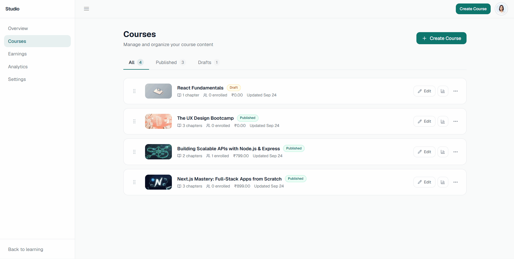</p>

### Course purchase

Checkout with coupon, tax, and enrollment:

<p align="center">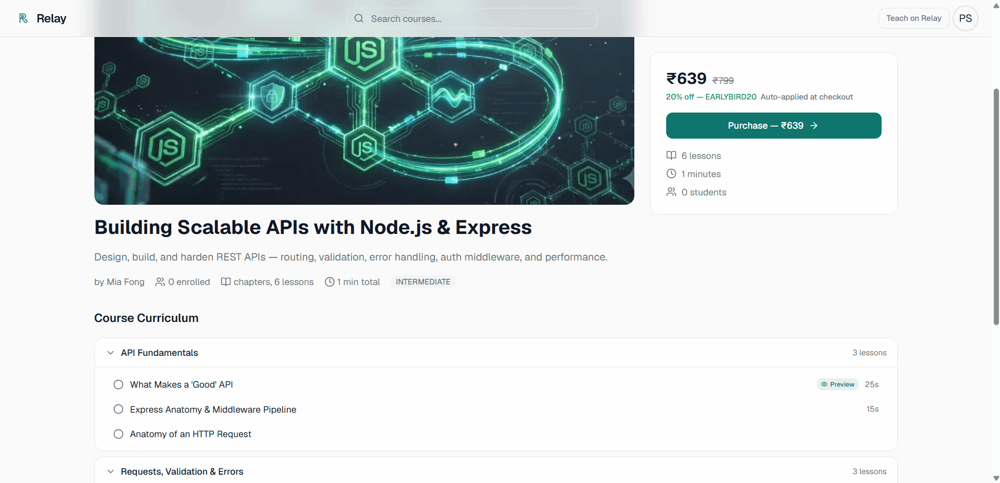</p>

### Learner

<table width="100%">
  <tr>
    <td width="50%" align="center">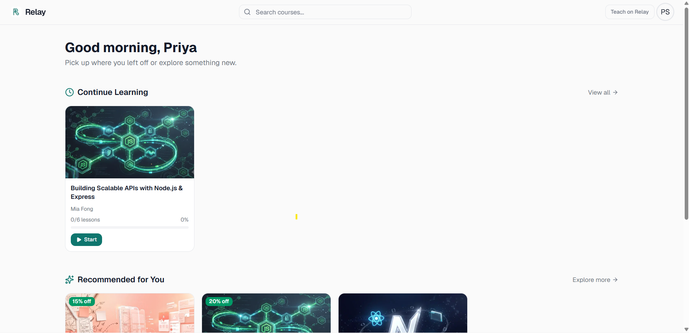</td>
    <td width="50%" align="center">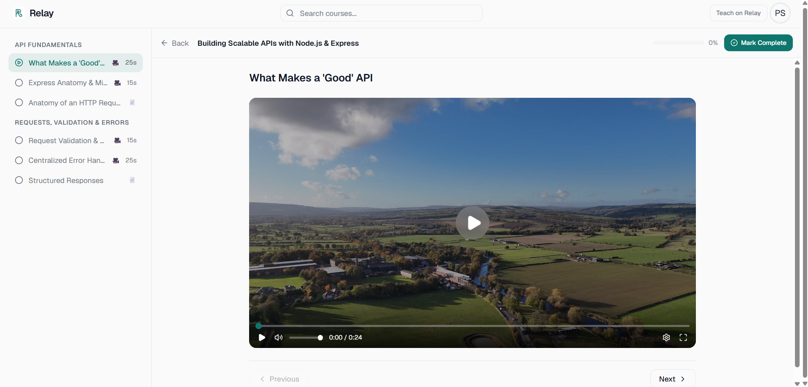</td>
  </tr>
  <tr>
    <td width="50%" align="center">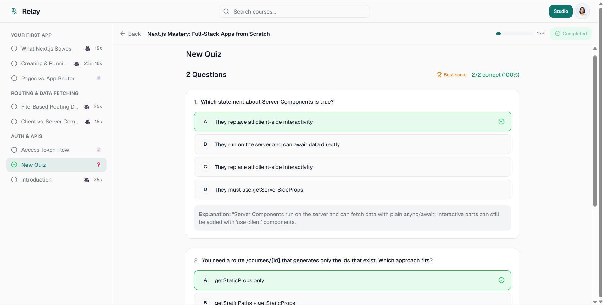</td>
    <td width="50%" align="center">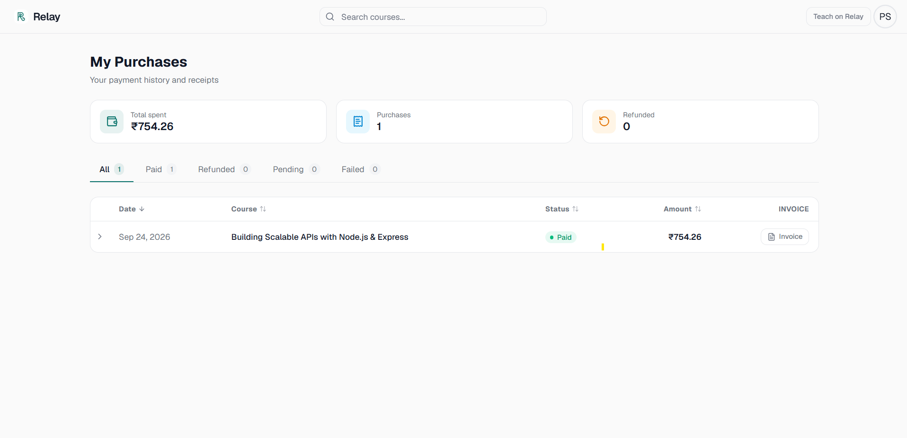</td>
  </tr>
</table>

### Instructor

<table width="100%">
  <tr>
    <td width="50%" align="center">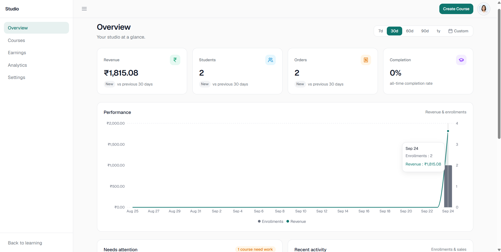</td>
    <td width="50%" align="center">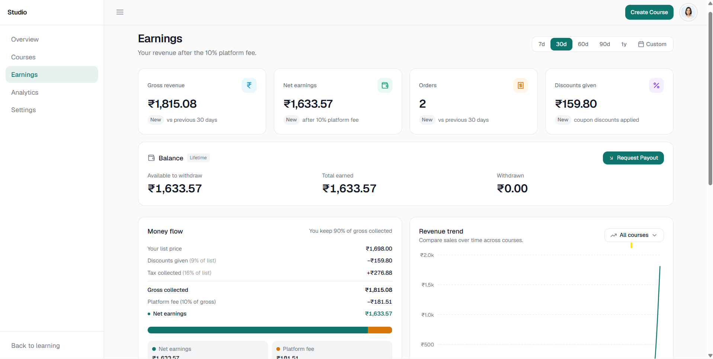</td>
  </tr>
  <tr>
    <td width="50%" align="center">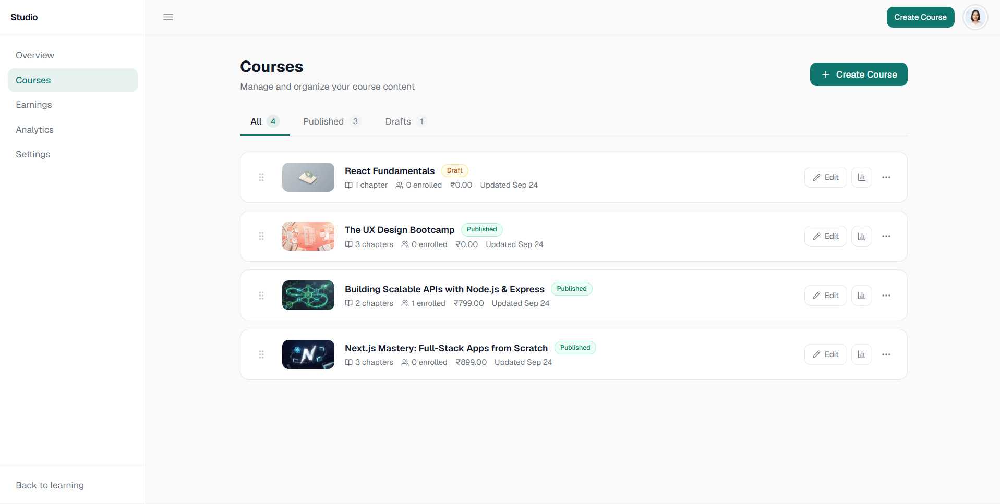</td>
    <td width="50%" align="center">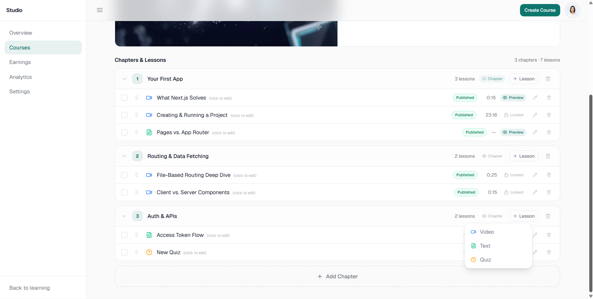</td>
  </tr>
</table>

### Admin

<table width="100%">
  <tr>
    <td width="50%" align="center">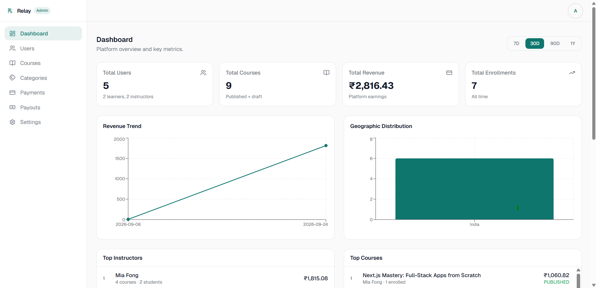</td>
    <td width="50%" align="center">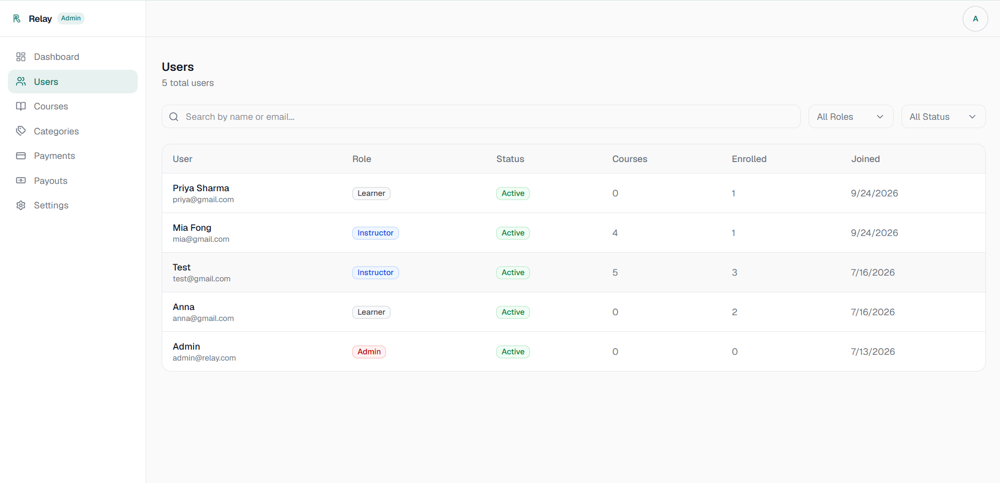</td>
  </tr>
  <tr>
    <td width="50%" align="center">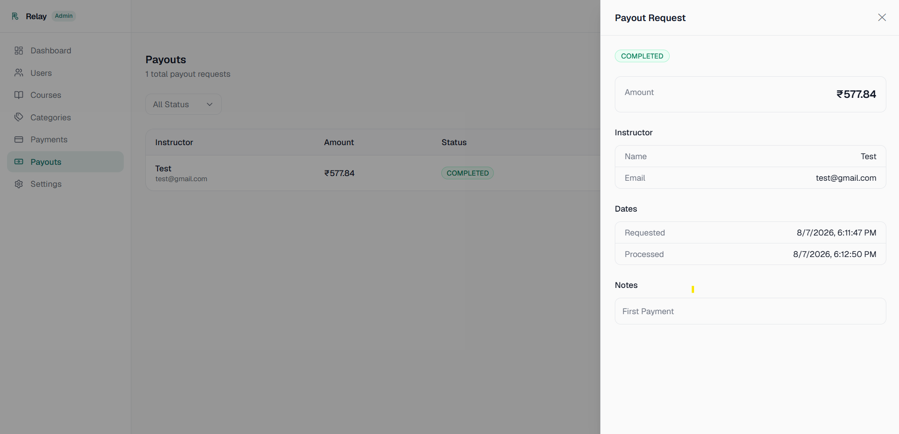</td>
    <td width="50%" align="center">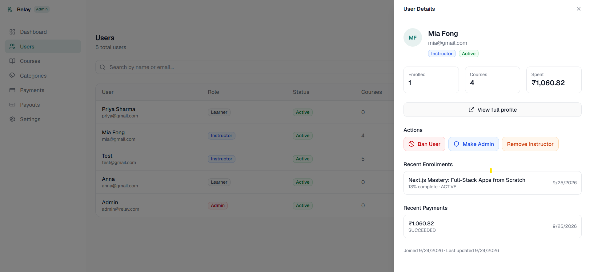</td>
  </tr>
</table>

## Project layout

```
relay/
├── client/                     # Next.js frontend
│   ├── app/
│   │   ├── (auth)/             # Sign in, sign up
│   │   ├── (protected)/        # Learner: courses, checkout, account, studio
│   │   └── (admin)/            # Admin panel, separate layout and routes
│   ├── components/
│   │   ├── learner/            # Navbar, course cards, player, checkout
│   │   ├── studio/             # Instructor: overview, analytics, earnings
│   │   ├── admin/              # Dashboard, user/course/payment tables
│   │   └── shared/             # Avatar upload, image crop, filters
│   ├── services/               # API client functions
│   ├── hooks/                  # Video player and auth hooks
│   └── types/                  # TypeScript types
├── server/
│   └── src/
│       ├── modules/
│       │   ├── auth/           # Register, login, JWT, role checks
│       │   ├── courses/        # CRUD, publish workflow, slug routing
│       │   ├── chapters/       # Chapter ordering
│       │   ├── lessons/        # Lesson CRUD, content types, quiz editor
│       │   ├── enrollments/    # Enrollment, progress, quiz attempts
│       │   ├── payments/       # Checkout, tax, coupons, refunds
│       │   ├── instructor/     # Stats, earnings, coupons, payouts
│       │   ├── uploads/        # Presigned URLs, video completion, transcode
│       │   └── admin/          # Dashboard, users, courses, settings
│       ├── middleware/         # Auth, role checks, rate limiting, errors
│       └── lib/                # Prisma, Redis, S3 clients
└── docker-compose.yml          # RustFS + Redis
```

## Status and what I'd build next

### Harden first
- Wire a real gateway (Stripe or Razorpay) behind the idempotency and refund flows that already exist
- Add tests. The payments, enrollment, and transcoding paths deserve coverage before anything else
- Split the single 7-day JWT into a short-lived access token plus a rotating refresh token, so a leaked cookie stops being valid for a week
- Extend rate limiting beyond the checkout and coupon routes to the rest of the API

### Then
- Watch-position resume, since progress is per-lesson today
- Live status via WebSocket instead of 3-second polling
- Error boundaries across the React tree
- Google OAuth

### Further out
- Course reviews and ratings
- Full-text search over the catalog
- Distributed transcoding workers if one FFmpeg host stops being enough